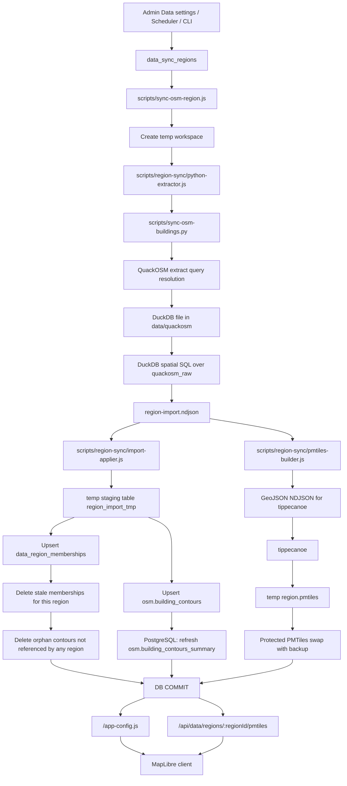

# OSM Import Pipeline

This document describes the managed end-to-end OSM building import pipeline used by region syncs.
It covers the real runtime path implemented by [`scripts/sync-osm-region.js`](../scripts/sync-osm-region.js),
its helper modules under [`scripts/region-sync/`](../scripts/region-sync/), and
[`scripts/sync-osm-buildings.py`](../scripts/sync-osm-buildings.py), including `quackosm`,
`duckdb`, the runtime DB (`postgres` or `sqlite`), and region `PMTiles`.

## Scope

The pipeline below is the source of truth for managed region syncs where:

- region config is stored in `Admin -> Data`
- `sourceType=extract_query`
- sync is started by scheduler, queue, admin action, or CLI

Primary entrypoints:

- `npm run tiles:build -- --region-id=<id>`
- `node scripts/sync-osm-region.js --region-id=<id>`
- in-app scheduler/queue launching the same script per region

There is also a maintenance-only variant:

- `node scripts/sync-osm-region.js --region-id=<id> --pmtiles-only`

`--pmtiles-only` rebuilds a region archive from already imported DB rows and skips the `quackosm` / `duckdb` import stage.

## Prerequisites

- Python with `quackosm` and `duckdb`
- `tippecanoe` available in `PATH` or configured through `TIPPECANOE_BIN`
- runtime DB configured through `DB_PROVIDER`
  - `postgres` uses PostgreSQL + PostGIS as the main production path
  - `sqlite` remains supported as a dev/fallback path

The Docker runtime image already contains Python, `quackosm`, `duckdb`, and `tippecanoe`.

## End-to-end flow

1. Region definition lives in `data_sync_regions`.
2. Scheduler or manual trigger chooses a concrete `regionId`.
3. [`scripts/sync-osm-region.js`](../scripts/sync-osm-region.js) loads the region config through `scripts/region-sync/db-ingester.js` and validates:
   - region exists
   - `sourceType=extract_query`
   - extract query is not empty
4. The script creates a temp workspace under the OS temp directory for the current run.
5. The orchestrator delegates the extract stage to `scripts/region-sync/python-extractor.js`, which resolves Python and calls the importer with:
   - `--extract-query <region.sourceValue>`
   - `--out-ndjson <workspace>/region-import.ndjson`
6. [`scripts/sync-osm-buildings.py`](../scripts/sync-osm-buildings.py) uses `quackosm` to resolve the extract query and materialize the result into a DuckDB file under `data/quackosm/`.
7. The Python importer opens that DuckDB file, loads the `spatial` extension, and runs SQL over `quackosm_raw` to:
   - keep only OSM `way` and `relation`
   - keep only `POLYGON` and `MULTIPOLYGON`
   - serialize tags to JSON
   - serialize geometry to GeoJSON
   - compute `min_lon`, `min_lat`, `max_lon`, `max_lat`
8. Filtered rows are exported as NDJSON into the workspace file `region-import.ndjson`.
9. `scripts/region-sync/pmtiles-builder.js` converts that NDJSON stream into newline-delimited GeoJSON features for `tippecanoe`.
10. The same module runs `tippecanoe` and builds a region archive into `<workspace>/region.pmtiles`.
11. The same imported NDJSON is loaded into a DB temp staging table by `scripts/region-sync/import-applier.js`:
    - PostgreSQL: `region_import_tmp`
    - SQLite: `temp.region_import_tmp`
12. Inside one DB transaction the sync:
    - upserts all imported rows into `osm.building_contours`
    - upserts `(region_id, osm_type, osm_id)` into `data_region_memberships`
    - removes memberships that disappeared from the current import for that region
    - deletes only true orphans from `osm.building_contours`, meaning objects no longer referenced by any region

13. PostgreSQL also refreshes `osm.building_contours_summary` in the same transaction.
14. `scripts/region-sync/import-applier.js` swaps the new PMTiles archive into `data/regions/buildings-region-<slug>.pmtiles` with backup-and-rollback protection.
15. If the DB transaction commits, the backup is dropped and the new archive becomes current.
16. If any step fails after swap staging, the DB transaction is rolled back and the previous PMTiles file is restored.
17. Runtime clients later receive the region PMTiles metadata via `/app-config.js` and fetch the archive through `/api/data/regions/:regionId/pmtiles`.
18. For managed in-app syncs, `ServerRuntime` boot modules then rebuild search index tables and schedule filter-tag cache refresh; direct standalone CLI runs do not add this wrapper step.

## Mermaid diagram

## Component responsibilities

### `scripts/sync-osm-region.js`

- Thin orchestrator for managed region sync.
- Parses CLI args, creates runtime options/workspace, and runs either:
  - full import path
  - `--pmtiles-only` rebuild path
- Can now be safely imported without side effects; CLI execution happens only under `require.main === module`.

### `scripts/region-sync/python-extractor.js`

- Resolves Python executable candidates.
- Verifies `quackosm` and `duckdb` Python dependencies before starting import.
- Invokes `scripts/sync-osm-buildings.py` and turns Python setup failures into explicit sync errors.

### `scripts/region-sync/db-ingester.js`

- Small facade that exposes the region-sync DB/public helpers used by the orchestrator.
- Re-exports region loading/export helpers and transactional import/apply helpers.

### `scripts/region-sync/region-db.js`

- Loads region config from PostgreSQL or SQLite.
- Validates managed-sync prerequisites for a region.
- Exports current region members back to NDJSON for `--pmtiles-only` rebuilds.

### `quackosm`

- Resolves the configured extract query.
- Downloads or reuses the matching extract.
- Filters source data by `tags_filter={'building': True}` before the project-specific SQL stage.
- Writes the raw import result into DuckDB as `quackosm_raw`.

### `duckdb`

- Acts as the transformation stage between raw OSM extract data and ArchiMap import rows.
- Runs spatial SQL to normalize geometry and derive bbox columns.
- Produces a compact NDJSON stream used by both:
  - DB import
  - PMTiles generation

### PostgreSQL / SQLite

- `osm.building_contours` is the global union dataset used by existing building, search, and filter APIs.
- `data_region_memberships` keeps per-region ownership, which prevents one overlapping region sync from deleting objects still needed by another region.
- PostgreSQL keeps `osm.building_contours_summary` updated for runtime fast paths.
- SQLite follows the same logical flow but uses local temp tables and file-backed DBs.

### `scripts/region-sync/import-applier.js`

- Streams NDJSON rows into the provider-specific staging table.
- Applies the authoritative transactional upsert/cleanup logic for PostgreSQL and SQLite.
- Performs the protected PMTiles publish/swap so DB commit and archive promotion stay in sync.

### Search source normalization

- `building_search_source` and `building_search_fts` are populated from raw `osm.building_contours.tags_json` plus `local.architectural_info`.
- Parsing and fallback composition for `name`, `address`, `style`, and `architect` now happens in Node.js via `src/lib/server/services/search-index-source.service.js`.
- The same normalization code is shared by incremental runtime refreshes and the full rebuild worker for both PostgreSQL and SQLite.

### PMTiles

- Each region gets its own archive under `data/regions/`.
- The file is built outside the DB transaction and then swapped into place with rollback protection.
- The API serves it through `/api/data/regions/:regionId/pmtiles` with Range support, validators, and cache headers.

### `scripts/region-sync/pmtiles-builder.js`

- Converts import NDJSON rows into newline-delimited GeoJSON features for `tippecanoe`.
- Detects `tippecanoe` from `TIPPECANOE_BIN` or `PATH`.
- Computes region bounds during export and returns them to the orchestrator summary.

## Why the pipeline is split this way

- `quackosm` is responsible for extract acquisition and initial OSM filtering.
- `duckdb` is the transformation layer that can run spatial SQL cheaply on the extracted data.
- NDJSON is the handoff format between importer, DB upsert logic, and PMTiles generation.
- The runtime DB stores the authoritative union dataset used by all building/search/filter APIs.
- Region membership tracking makes overlapping regional syncs safe.
- PMTiles are region-local read models optimized for map delivery, not the source of truth for search/building endpoints.

## Data artifacts created during sync

- Temporary workspace:
  - `region-import.ndjson`
  - `region-build.ndjson`
  - `region.pmtiles`
- Persistent intermediate extraction cache:
  - `data/quackosm/*.duckdb`
- Persistent runtime outputs:
  - `osm.building_contours`
  - `data_region_memberships`
  - `osm.building_contours_summary` in PostgreSQL
  - `data/regions/buildings-region-<slug>.pmtiles`

## Managed runtime follow-up after successful sync

- In-app sync flow (scheduler/admin queue) runs follow-up jobs from `ServerRuntime` boot modules.
- These jobs rebuild `building_search_source` and `building_search_fts` through `search-index.boot.js`, then reset and warm `filter_tag_keys_cache` through `filter-tag-keys.boot.js`.
- Direct standalone execution of `scripts/sync-osm-region.js` updates imported OSM data and PMTiles only; it does not run these wrapper jobs by itself.

## Failure handling and invariants

- Syncs are serialized through one in-process queue; parallel region imports are not allowed.
- A `0`-feature import is treated as failure; current DB state and current PMTiles stay untouched.
- PMTiles swap is protected by a backup file and explicit rollback path.
- Cleanup deletes only contours that have no remaining membership in any region.
- Interrupted runs are recoverable because region sync status and run history are stored separately from the import workspace.

## Local edits and sync corner cases

Accepted local edits are stored separately from imported OSM contours:

- accepted and partially accepted admin merges are written to `local.architectural_info`
- user submissions are stored in `user_edits.building_user_edits`
- region sync updates only imported OSM data (`osm.building_contours`, `data_region_memberships`, PMTiles)

This means sync does not currently cascade changes into local edits automatically.

### What is handled now

- Accepted local edits survive normal OSM reimports because sync does not overwrite `local.architectural_info`.
- Overlapping regions stay safe because OSM contour cleanup is driven by `data_region_memberships`, not by a full-table replace.
- Every new or updated user edit stores a snapshot of the OSM baseline at submission time in `user_edits.building_user_edits`:
  - `source_tags_json`
  - `source_osm_updated_at`
- Account and admin edit APIs now expose runtime state for every edit:
  - `osmPresent`
  - `orphaned`
  - `sourceOsmChanged`
  - `canReassign`
- Admin merge has two stale guards:
  - local stale guard: merge returns `409 EDIT_OUTDATED` when `local.architectural_info.updated_at` is newer than the edit creation time
  - upstream stale guard: merge returns `409 EDIT_OUTDATED_OSM` when current OSM tags differ from the stored source snapshot

### Corner case: building was deleted from OSM / disappeared from the extract

Implemented behavior:

- on the next successful sync, the object disappears from that region's imported set
- if no other region still references it, the sync deletes the row from `osm.building_contours`
- the accepted local row in `local.architectural_info` is not deleted automatically
- `/api/building/:osmType/:osmId` returns `404` because the contour/geometry no longer exists
- map/filter/search pipelines stop showing the building because they are built from `osm.building_contours`
- `user_edits.building_user_edits` history rows stay intact and are now marked as:
  - `osmPresent=false`
  - `orphaned=true` for merged local data
- orphaned edits are visible in:
  - account edit history
  - admin edit list
  - admin edit detail
- admin can reassign the edit to another existing OSM object via `POST /api/admin/building-edits/:editId/reassign`
- master admin can fully delete the orphaned edit only when its merged local state is not shared with other accepted edits

Reassign rules:

- pending edits can be moved to another existing contour; the edit target and stored OSM snapshot are updated
- accepted / partially accepted edits move the shared local merged record from the old OSM object to the new one
- accepted / partially accepted history rows pointing to the old object are updated to the new object as part of the same operation
- if the target already contains conflicting local fields, reassignment is rejected unless `force=true`

### Corner case: pending edit points to an OSM object that no longer exists

Implemented behavior:

- admin merge is blocked with `409 EDIT_TARGET_MISSING`
- the admin must first reassign the edit to another existing OSM object
- after reassignment, the edit can be reviewed and merged normally

This prevents merging curated data into an already deleted contour id.

### Corner case: new OSM tags conflict with accepted or pending local edits

Implemented behavior:

- sync updates `osm.building_contours.tags_json` from the newest OSM extract
- accepted local values in `local.architectural_info` remain unchanged
- user edits keep the original OSM snapshot captured at submission time
- admin detail now surfaces the drift state through `sourceOsmChanged`
- merge is blocked with `409 EDIT_OUTDATED_OSM` unless the moderator explicitly uses `force=true`

This closes the most dangerous variant of the conflict: silently merging a user edit against a newer upstream OSM baseline.

### Corner case: accepted local record overrides only some fields

Current behavior:

- local rows are still sparse by design: some fields can be filled locally while others stay `NULL`
- for fields left `NULL`, runtime can still fall back to current OSM tags
- for fields explicitly filled in `local.architectural_info`, local values shadow later OSM changes in building-info and search paths

Important note:

- filter semantics are still not fully identical to search/building-info precedence
- if the source OSM tag exists, some filter paths can still prefer the raw OSM tag value before local fallback

This remaining inconsistency is narrower than before because drift is now detected during moderation, but precedence is still not perfectly uniform across all read paths.

### Corner case: master admin needs to fully remove a bad or obsolete edit

Implemented behavior:

- `DELETE /api/admin/building-edits/:editId` is available only to `master admin`
- `pending`, `rejected`, and `superseded` edits are removed as plain history records
- `accepted` / `partially_accepted` edits are deleted together with `local.architectural_info` only when they are the only accepted edit for that `(osm_type, osm_id)`
- if the same building already has other accepted edits, delete is blocked with `409 EDIT_DELETE_SHARED_MERGED_STATE`

Why the block exists:

- accepted edits do not own isolated local records anymore; they contribute to shared merged state per building
- once multiple accepted edits exist for one building, deleting one history row without reconstructing the merged state would leave `local.architectural_info` semantically inconsistent

Operational result:

- master admin can completely purge obviously wrong pending/rejected history rows
- master admin can fully remove a lone accepted edit and roll back its merged local data
- for buildings with multiple accepted edits, the safe path remains:
  - reassign surviving data if needed
  - or manually create a compensating edit instead of destructive deletion

### Practical conclusion

The current sync pipeline now handles the two critical lifecycle gaps:

- orphaned local edits are visible and reassignable
- upstream OSM drift is detected before admin merge
- destructive edit cleanup exists, but only under master-admin control and only when merged state can be removed safely

Remaining limitation:

- read-time precedence between OSM tags and accepted local fields is still not fully unified across every filter/search/detail surface, even though moderation now blocks stale merges.

## Related docs

- [Data Flow](data-flow.md)
- [Architecture](architecture.md)
- [Runbook](runbook.md)
- [PMTiles Performance](performance/pmtiles.md)
- [Environment](dev/env.md)
