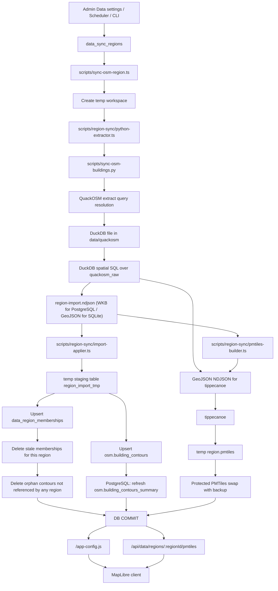

# OSM Import Pipeline

This document describes the managed end-to-end OSM building import pipeline used by region syncs.
It covers the real runtime path implemented by [`scripts/sync-osm-region.ts`](../scripts/sync-osm-region.ts),
its helper modules under [`scripts/region-sync/`](../scripts/region-sync/), and
[`scripts/sync-osm-buildings.py`](../scripts/sync-osm-buildings.py), including `quackosm`,
`duckdb`, the runtime DB (`postgres` or `sqlite`), and region `PMTiles`.

## Scope

The pipeline below is the source of truth for managed region syncs where:

- region config is stored in `Admin -> Data`
- `sourceType=extract`
- sync is started by scheduler, queue, admin action, or CLI

Primary entrypoints:

- `npm run tiles:build -- --region-id=<id>`
- `node --import tsx scripts/sync-osm-region.ts --region-id=<id>`
- in-app scheduler/queue launching the same script per region

There is also a maintenance-only variant:

- `node --import tsx scripts/sync-osm-region.ts --region-id=<id> --pmtiles-only`

`--pmtiles-only` rebuilds a region archive from already imported DB rows and skips the `quackosm` / `duckdb` import stage.

## Prerequisites

- Python with `quackosm` and `duckdb`
- `tippecanoe` available in `PATH` or configured through `TIPPECANOE_BIN`
- runtime DB configured through `DB_PROVIDER`
  - `postgres` uses PostgreSQL + PostGIS as the main production path
  - `sqlite` remains supported as a dev/fallback path

The Docker runtime image already contains Python, `quackosm`, `duckdb`, and `tippecanoe`.

## End-to-end flow

1. Region definition lives in `data_sync_regions`.
2. Scheduler or manual trigger chooses a concrete `regionId`.
3. [`scripts/sync-osm-region.ts`](../scripts/sync-osm-region.ts) loads the region config through `scripts/region-sync/db-ingester.ts` and validates:
   - region exists
   - `sourceType=extract`
   - canonical `extractSource` + `extractId` are present
   - `extractResolutionStatus=resolved`
4. The script creates a temp workspace under the OS temp directory for the run.
5. The orchestrator delegates the extract stage to `scripts/region-sync/python-extractor.ts`, which resolves Python and calls the importer with:
   - `--extract-query <region.extractId>`
   - `--extract-source <region.extractSource>`
   - PostgreSQL full sync: `--out-db-ndjson <workspace>/region-import.ndjson` plus `--out-geojson-ndjson <workspace>/region-build.ndjson` and `--out-summary-json <workspace>/region-export-summary.json`
   - SQLite full sync: `--out-ndjson <workspace>/region-import.ndjson`
6. [`scripts/sync-osm-buildings.py`](../scripts/sync-osm-buildings.py) uses `quackosm` to resolve the extract query and materialize the result into a DuckDB file under `data/quackosm/`.
7. The Python importer opens that DuckDB file, loads the `spatial` extension, and runs SQL over `quackosm_raw` to:
   - keep only OSM `way` and `relation`
   - keep only `POLYGON` and `MULTIPOLYGON`
   - serialize tags to JSON
   - serialize geometry as WKB hex for PostgreSQL DB import handoff
   - serialize geometry as GeoJSON for SQLite import handoff and PMTiles build input
   - derive `feature_kind` from tags so rows with `building:part` become `building_part`, regardless of the tag value, while any row that also has a `building` tag stays `building`
   - compute `min_lon`, `min_lat`, `max_lon`, `max_lat`
8. Filtered rows are exported as workspace artifacts:
   - PostgreSQL full sync: `region-import.ndjson` (WKB hex + bbox + tags), `region-build.ndjson` (GeoJSON features for `tippecanoe`), and `region-export-summary.json` (feature count + bounds)
   - SQLite full sync: `region-import.ndjson` (GeoJSON + bbox + tags)
9. The PMTiles input is prepared as newline-delimited GeoJSON features for `tippecanoe`:
   - PostgreSQL full sync: reuses the already exported `region-build.ndjson`
   - SQLite full sync: `scripts/region-sync/pmtiles-builder.ts` converts import NDJSON into `region-build.ndjson`
   - `--pmtiles-only`: `scripts/region-sync/region-db.ts` streams region members directly from the runtime DB into `region-build.ndjson` without creating an intermediate import NDJSON file
   - every exported feature carries `feature_kind` so the client can split `building` and `building_part` layers without a second PMTiles archive
10. The same module runs `tippecanoe` and builds a region archive into `<workspace>/region.pmtiles`.
11. The imported DB NDJSON is loaded into a DB temp staging table by `scripts/region-sync/import-applier.ts`:
    - PostgreSQL: `region_import_tmp` with `geometry_wkb_hex`
    - SQLite: `temp.region_import_tmp` with `geometry_json`
12. Inside one DB transaction the sync:
    - upserts all imported rows into `osm.building_contours`
    - upserts `(region_id, osm_type, osm_id)` into `data_region_memberships`
    - removes memberships that disappeared from the import for that region
    - deletes only true orphans from `osm.building_contours`, meaning objects no longer referenced by any region

13. PostgreSQL also refreshes `osm.building_contours_summary` in the same transaction.
14. `scripts/region-sync/import-applier.ts` swaps the new PMTiles archive into `data/regions/buildings-region-<slug>.pmtiles` with backup-and-rollback protection.
15. If the DB transaction commits, the backup is dropped and the new archive becomes active.
16. If any step fails after swap staging, the DB transaction is rolled back and the previous PMTiles file is restored.
17. Runtime clients later receive the region PMTiles metadata via `/app-config.js` and fetch the archive through `/api/data/regions/:regionId/pmtiles`.
18. For managed in-app syncs, `ServerRuntime` boot modules then rebuild search index tables and schedule filter-tag cache refresh.
19. Direct standalone full sync execution (`node --import tsx scripts/sync-osm-region.ts --region-id=<id>` and wrappers such as `npm run tiles:build -- --region-id=<id>`) runs the same search-index and filter-tag follow-up workers before exiting; `--pmtiles-only` skips them because it does not change imported DB rows.

## Mermaid diagram

## Component responsibilities

### `scripts/sync-osm-region.ts`

- Thin orchestrator for managed region sync.
- Parses CLI args, creates runtime options/workspace, and runs either:
  - full import path
  - `--pmtiles-only` rebuild path
- Can be imported without side effects; CLI execution happens only under `require.main === module`.

### `scripts/region-sync/python-extractor.ts`

- Resolves Python executable candidates.
- Verifies `quackosm` and `duckdb` Python dependencies before starting import.
- Invokes `scripts/sync-osm-buildings.py` and turns Python setup failures into explicit sync errors.
- Exposes both fuzzy candidate search (`--resolve-extract-query`) and exact canonical resolution (`--resolve-exact-extract`) for admin data settings.

### `scripts/region-sync/db-ingester.ts`

- Small facade that exposes the region-sync DB/public helpers used by the orchestrator.
- Re-exports region loading/export helpers and transactional import/apply helpers.

### `scripts/region-sync/region-db.ts`

- Loads region config from PostgreSQL or SQLite.
- Validates managed-sync prerequisites for a region.
- Exports region members directly to GeoJSON feature NDJSON for `--pmtiles-only` rebuilds.

### `quackosm`

- Resolves the configured extract query.
- Downloads or reuses the matching extract.
- If the precalculated index download is rate-limited, the importer retries with local index recalculation and caches the result for future runs.
- Filters source data by `tags_filter={'building': True, 'building:part': True}` before the project-specific SQL stage.
- Writes the raw import result into DuckDB as `quackosm_raw`.

### Canonical extract resolution and multiple matches

- Managed region sync does not resolve ambiguous extract queries during the import itself. It requires an already stored canonical pair `extractSource + extractId`.
- Admin region editing uses the Python extractor in two modes:
  - `--resolve-extract-query` returns ranked extract candidates for manual selection.
  - `--resolve-exact-extract` validates the chosen canonical extract before the region is saved.
- In exact-resolution mode, [`scripts/sync-osm-buildings.py`](../scripts/sync-osm-buildings.py) catches `OsmExtractMultipleMatchesError` and returns structured JSON instead of a raw traceback:
  - `candidate: null`
  - `errorCode: "multiple"`
  - `message`: upstream resolver message
  - `matchingExtractIds[]`: canonical extract ids that matched the query
- The data-settings service converts that result into a user-facing validation error telling the admin to pick one extract manually.
- Because of that validation, ambiguous canonical extract selection is rejected at save time, and managed sync later refuses to start for any region whose `extractResolutionStatus` is not `resolved`.

### `duckdb`

- Acts as the transformation stage between raw OSM extract data and ArchiMap import rows.
- Runs spatial SQL to normalize geometry and derive bbox columns.
- Produces provider-specific handoff artifacts:
  - PostgreSQL full sync: WKB-based NDJSON for DB import, GeoJSON feature NDJSON for PMTiles, and summary metadata in one DuckDB pass
  - SQLite full sync: one GeoJSON-based NDJSON reused by DB import and PMTiles generation

### PostgreSQL / SQLite

- `osm.building_contours` is the global union dataset used by existing building, search, and filter APIs.
- `data_region_memberships` keeps per-region ownership, which prevents one overlapping region sync from deleting objects used by another region.
- PostgreSQL stores the authoritative contour geometry in PostGIS `geom`; GeoJSON is emitted on demand for building responses and `--pmtiles-only` exports instead of being persisted twice.
- PostgreSQL keeps `osm.building_contours_summary` updated for runtime fast paths.
- SQLite follows the same logical flow but uses local temp tables and file-backed DBs.

### `scripts/region-sync/import-applier.ts`

- Streams NDJSON rows into the provider-specific staging table.
- Applies the authoritative transactional upsert/cleanup logic for PostgreSQL and SQLite.
- PostgreSQL consumes WKB hex rows and materializes PostGIS `geom` directly with `ST_GeomFromWKB(...)`, avoiding a GeoJSON roundtrip during full sync.
- Performs the protected PMTiles publish/swap so DB commit and archive promotion stay in sync.

### Search source normalization

- PostgreSQL keeps only searchable rows in `building_search_source` and derives `search_tsv` there through a generated column.
- SQLite keeps `building_search_source` plus `building_search_fts`.
- Parsing and fallback composition for `name`, `address`, `style`, `architect`, and `design_ref` happens in Node.js via `src/lib/server/services/search-index-source.service.ts`.
- pure `building:part` rows are excluded from the search read model so part geometries do not create duplicate search hits for the same visible building; rows that also have a `building` tag stay searchable as normal buildings.
- The same normalization code is shared by incremental runtime refreshes and the full rebuild worker for both PostgreSQL and SQLite.

### PMTiles

- Each region gets its own archive under `data/regions/`.
- The file is built outside the DB transaction and then swapped into place with rollback protection.
- The API serves it through `/api/data/regions/:regionId/pmtiles` with Range support, validators, and cache headers.

### `scripts/region-sync/pmtiles-builder.ts`

- Converts import NDJSON rows into newline-delimited GeoJSON features for `tippecanoe` when the importer did not already emit a dedicated GeoJSON build artifact.
- Detects `tippecanoe` from `TIPPECANOE_BIN` or `PATH`.
- Computes region bounds during export for Node-side conversions; PostgreSQL full sync reuses importer-produced summary metadata instead of re-reading `region-import.ndjson`.

## Why the pipeline is split this way

- `quackosm` is responsible for extract acquisition and initial OSM filtering.
- `duckdb` is the transformation layer that can run spatial SQL cheaply on the extracted data.
- NDJSON is the handoff format between importer, DB upsert logic, and PMTiles generation.
- PostgreSQL full sync keeps DB import and PMTiles build artifacts separate so the DB path can use WKB instead of serializing GeoJSON only to parse it back into PostGIS later.
- PostgreSQL full sync writes both artifacts and summary metadata in one DuckDB scan, so the orchestrator does not need a second exporter pass or a post-export NDJSON summary pass.
- The runtime DB stores the authoritative union dataset used by all building/search/filter APIs.
- Region membership tracking makes overlapping regional syncs safe.
- PMTiles are region-local read models optimized for map delivery, not the source of truth for search/building endpoints.

## Data artifacts created during sync

- Temporary workspace:
  - `region-import.ndjson`
    - PostgreSQL full sync: WKB hex + bbox + tags
    - SQLite full sync: GeoJSON + bbox + tags
  - `region-build.ndjson`
    - PostgreSQL full sync: exported directly by the importer
    - SQLite full sync: generated by `pmtiles-builder.ts`
    - `--pmtiles-only`: streamed directly from the runtime DB by `region-db.ts`
  - `region-export-summary.json`
    - PostgreSQL full sync: feature count + bounds emitted directly by the importer
  - `region.pmtiles`
- Persistent intermediate extraction cache:
  - `data/quackosm/*.duckdb`
  - QuackOSM source indexes under `data/cache/QuackOSM/*.geojson` when the container uses the persisted cache root
- Persistent runtime outputs:
  - `osm.building_contours`
  - `data_region_memberships`
  - `osm.building_contours_summary` in PostgreSQL
  - `data/regions/buildings-region-<slug>.pmtiles`

## Managed runtime follow-up after successful sync

- In-app sync flow (scheduler/admin queue) runs follow-up jobs from `ServerRuntime` boot modules.
- These jobs rebuild the search read-model through `search-index.boot.js` (`building_search_source` in PostgreSQL, `building_search_source` + `building_search_fts` in SQLite), then reset and warm `filter_tag_keys_cache` through `filter-tag-keys.boot.js`.
- Direct standalone full sync execution of `scripts/sync-osm-region.ts` invokes the same rebuild workers itself, so search/filter read-models stay aligned after new region imports and normal region updates even without the in-app runtime wrapper.
- Ordinary app/container restarts reuse the persisted `filter_tag_keys_cache`; there is no unconditional startup rebuild. The first `GET /api/filter-tag-keys` read cold-starts the cache only when the table is empty.
- `--pmtiles-only` rebuilds only the archive from DB rows and intentionally skips search/filter follow-up because imported OSM rows are unchanged.
- The archive remains a single regional source of truth; `building_part` is just another feature kind inside the same PMTiles file, not a separate archive.

## Failure handling and invariants

- Syncs are serialized through one in-process queue; parallel region imports are not allowed.
- A `0`-feature import is treated as failure; DB state and PMTiles stay untouched.
- QuackOSM index rate limits are treated as recoverable: the importer falls back to local index recalculation instead of failing the sync immediately.
- PMTiles swap is protected by a backup file and explicit rollback path.
- Cleanup deletes only contours that have no remaining membership in any region.
- Interrupted runs are recoverable because region sync status and run history are stored separately from the import workspace.

## Local edits and sync corner cases

Accepted local edits are stored separately from imported OSM contours:

- accepted and partially accepted admin merges are written to `local.architectural_info`
- user submissions are stored in `user_edits.building_user_edits`
- region sync updates only imported OSM data (`osm.building_contours`, `data_region_memberships`, PMTiles)

The import path does not rewrite local edits directly. After successful syncs, the runtime runs a reconciliation pass that removes redundant local overwrites when the imported OSM contour already contains the synced state.

### Local edit reconciliation

- Accepted local edits survive normal OSM reimports; when a synced building is imported back into the main contour dataset with the same local state, the runtime can delete the redundant `local.architectural_info` overwrite and keep only the compact history row.
- Overlapping regions stay safe because OSM contour cleanup is driven by `data_region_memberships`, not by a full-table replace.
- Every new or updated user edit stores a snapshot of the OSM baseline at submission time in `user_edits.building_user_edits`:
  - `source_tags_json`
  - `source_osm_updated_at`
- Account and admin edit APIs expose runtime state for every edit:
  - `osmPresent`
  - `orphaned`
  - `sourceOsmChanged`
  - `canReassign`
- Admin merge has two stale guards:
  - local stale guard: merge returns `409 EDIT_OUTDATED` when `local.architectural_info.updated_at` is newer than the edit creation time
  - upstream stale guard: merge returns `409 EDIT_OUTDATED_OSM` when OSM tags differ from the stored source snapshot
- OSM sync adds a second lifecycle:
  - master admins can publish merged local state back to OSM from `Admin -> Send to OSM`
  - after the next successful import, the runtime compares the imported contour with synced local state and removes the redundant `local.architectural_info` row when they match
  - the corresponding edit history rows are preserved in compact form with sync metadata and the OSM changeset reference

### Corner case: building was deleted from OSM / disappeared from the extract

- on the next successful sync, the object disappears from that region's imported set
- if no other region references it, the sync deletes the row from `osm.building_contours`
- the accepted local row in `local.architectural_info` is not deleted automatically
- `/api/building/:osmType/:osmId` returns `404` because the contour/geometry no longer exists
- map/filter/search pipelines stop showing the building because they are built from `osm.building_contours`
- `user_edits.building_user_edits` history rows stay intact and are marked as:
  - `osmPresent=false`
  - `orphaned=true` for merged local data
- orphaned edits are visible in:
  - account edit history
  - admin edit list
  - admin edit detail
- admin can reassign the edit to another existing OSM object via `POST /api/admin/building-edits/:editId/reassign`
- master admin can fully delete the orphaned edit only when its merged local state is not shared with other accepted edits

Reassign rules:

- pending edits can be moved to another existing contour; the edit target and stored OSM snapshot are updated
- accepted / partially accepted edits move the shared local merged record from the old OSM object to the new one
- accepted / partially accepted history rows pointing to the old object are updated to the new object as part of the same operation
- if the target already contains conflicting local fields, reassignment is rejected unless `force=true`

### Corner case: pending edit points to an OSM object that no longer exists

- admin merge is blocked with `409 EDIT_TARGET_MISSING`
- the admin must first reassign the edit to another existing OSM object
- after reassignment, the edit can be reviewed and merged normally

This prevents merging curated data into an already deleted contour id.

### Corner case: new OSM tags conflict with accepted or pending local edits

- sync updates `osm.building_contours.tags_json` from the newest OSM extract
- accepted local values in `local.architectural_info` remain unchanged
- user edits keep the original OSM snapshot captured at submission time
- admin detail surfaces the drift state through `sourceOsmChanged`
- merge is blocked with `409 EDIT_OUTDATED_OSM` unless the moderator explicitly uses `force=true`

This closes the most dangerous variant of the conflict: silently merging a user edit against a newer upstream OSM baseline.

### Corner case: accepted local record overrides only some fields

Field precedence:

- local rows are sparse by design: some fields can be filled locally while others stay `NULL`
- for fields left `NULL`, runtime falls back to OSM tags
- for fields explicitly filled in `local.architectural_info`, local values shadow later OSM changes in building-info and search paths

Important note:

- filter semantics now follow the same precedence as building-info and search for architectural fields
- accepted local values in `local.architectural_info` win over raw OSM tags when both are present

### Corner case: master admin needs to fully remove a bad or obsolete edit

- `DELETE /api/admin/building-edits/:editId` is available only to `master admin`
- `pending`, `rejected`, and `superseded` edits are removed as plain history records
- `accepted` / `partially_accepted` edits are deleted together with `local.architectural_info` only when they are the only accepted edit for that `(osm_type, osm_id)`
- if the same building already has other accepted edits, delete is blocked with `409 EDIT_DELETE_SHARED_MERGED_STATE`

Why the block exists:

- accepted edits do not own isolated local records anymore; they contribute to shared merged state per building
- once multiple accepted edits exist for one building, deleting one history row without reconstructing the merged state would leave `local.architectural_info` semantically inconsistent

Operational result:

- master admin can completely purge obviously wrong pending/rejected history rows
- master admin can fully remove a lone accepted edit and roll back its merged local data
- for buildings with multiple accepted edits, the safe path remains:
  - reassign surviving data if needed
  - or manually create a compensating edit instead of destructive deletion

### Practical conclusion

The sync pipeline handles the two critical lifecycle gaps:

- orphaned local edits are visible and reassignable
- upstream OSM drift is detected before admin merge
- destructive edit cleanup exists, but only under master-admin control and only when merged state can be removed safely

Read-time precedence between OSM tags and accepted local fields is not fully unified across every filter/search/detail surface, even though moderation blocks stale merges.

## Related docs

- [Data Flow](data-flow.md)
- [Architecture](architecture.md)
- [Runbook](runbook.md)
- [PMTiles Performance](performance/pmtiles.md)
- [Environment](dev/env.md)
